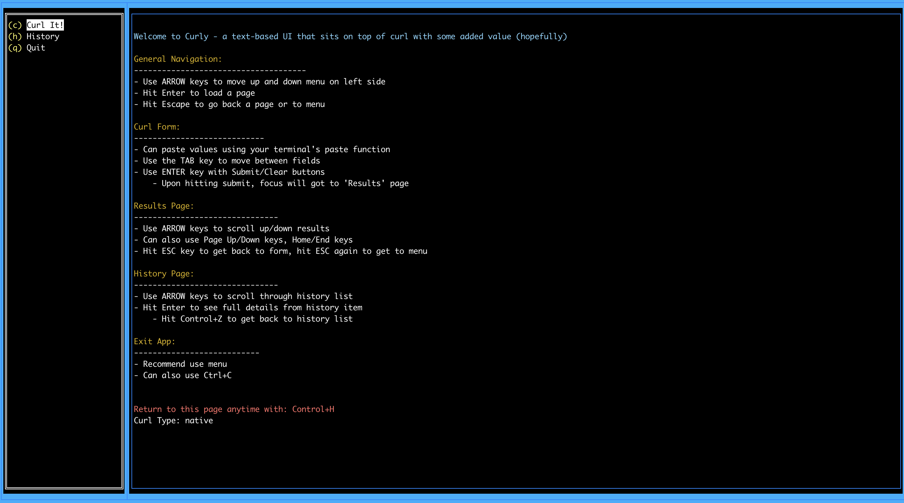
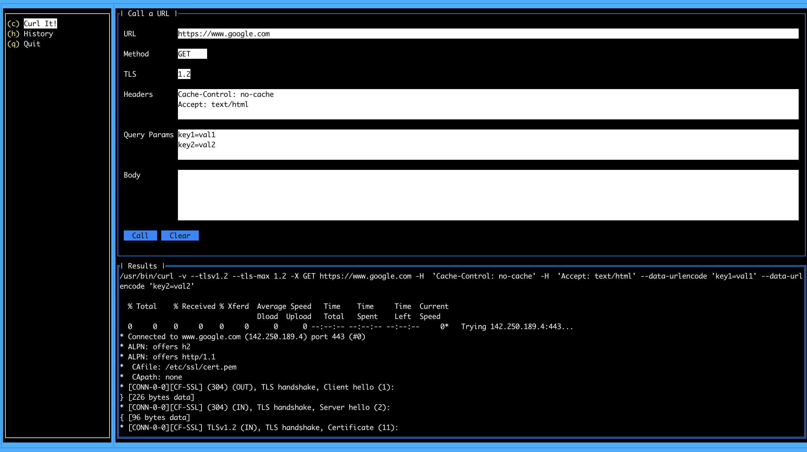
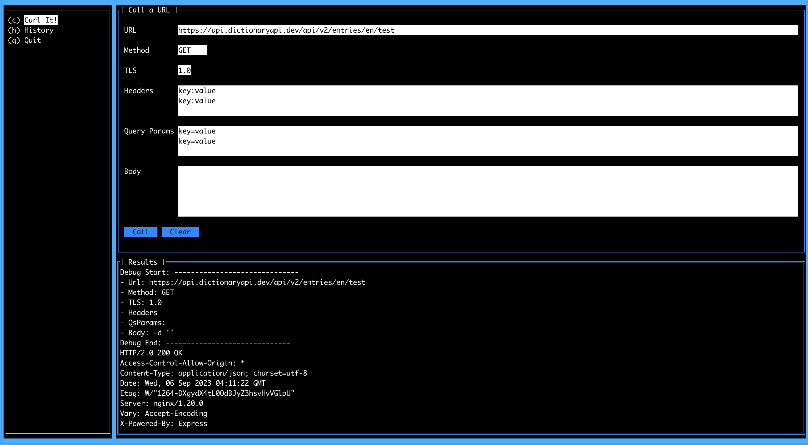
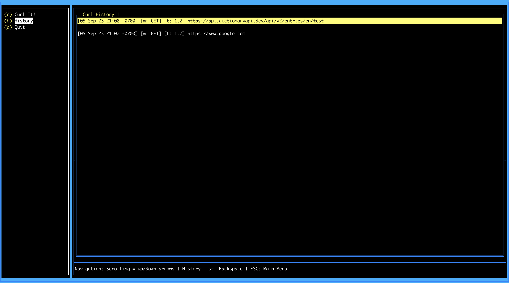
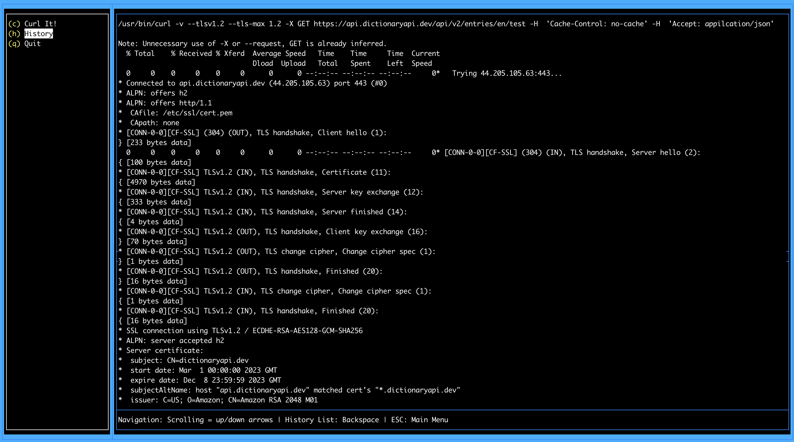

# curly
Simple/Easy Terminal App that leverages native curl command. Offers easy input, and saves results to a history list cache. 

### Download
you can always clone this repo and build the app yourself, however, if you want to just run the app, check the **'dist'** directory for a pre-built binary.

### Running
Open Command Prompt/Shell/Terminal, this is all keyboard, no mouse. If the 'curl' command is available on your machine (usually linux, macs, and unix machines have this pre-installed), Curly will leverage that and show its direct output. If not you might need to install it from your package manager. On Windows, this will default to the non-native client. 

**Note**: Welcome Screen will tell you which version is being used.

Change directory to where you put the binary after download...
``` 
shell> ./curly 
```

### Screen Shots
#### Welcome Screen

At the bottom of this screen, it will show which version of curl it is using
native if found, non-native if not found, ie: windows.

#### Curl Screen (native results)


#### Curl Screen (non-native results)


#### History Screen


#### History Details Screen



